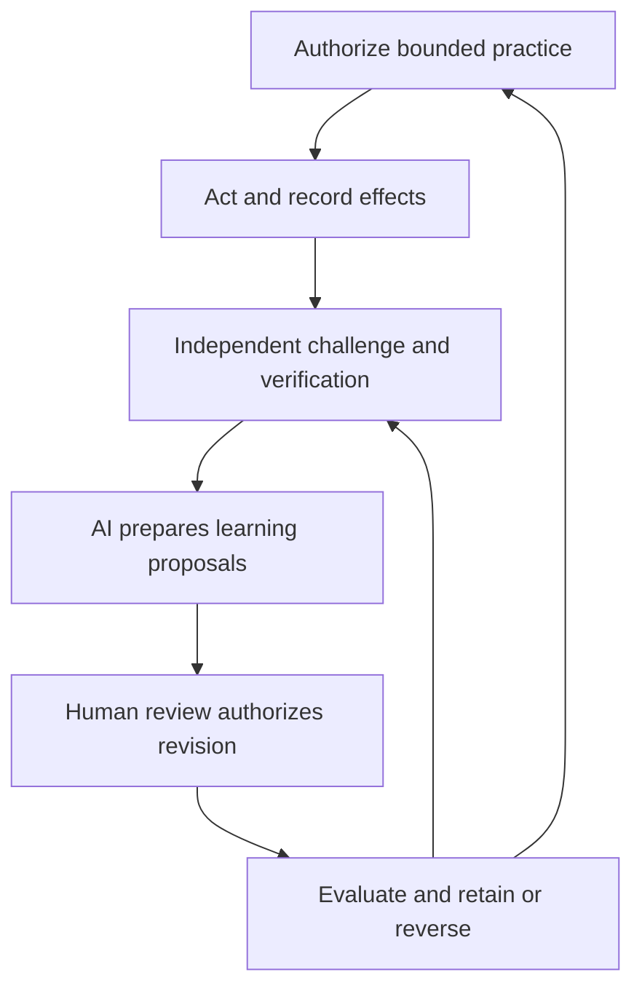

# Virtuously recursive institutional governance

**Executive summary:** Use verified outcomes to propose better rules, then authorize and evaluate each change. Improvement can mean less automation or fewer optional steps.

[Read the detailed guidance](#detailed-guidance).

## Detailed guidance

**PROPOSED THEORY AND PROCESS; no observed self-improving institution claimed.**

Governance becomes recursively useful when its decisions produce inspectable
outcomes, those outcomes improve the evidence and procedures used for later
decisions, and the improvement process itself remains governed. AI can lower
the cost of these connections. Recursion is virtuous only when it improves
substantive outcomes and human agency; repetition or expanding record volume
alone does not establish improvement.

## The proposed loop

Each arrow is conditional on actual authority, accessible evidence and capacity.
AI output is a proposal, not a verified observation or automatic revision.
Independent verification can use AI assistance, but requires noninvolved
responsibility and access not controlled solely by the contested actor.

## Three levels with distinct change rights

| Level | What can improve | Who must authorize |
|---|---|---|
| Object-level operation | Source packet, permitted routine response, correction and handover | Actual standing grant or competent case decision |
| Procedure-level learning | Workflow, sampling, review triggers, briefing and allocation of effort | Named competent policy owner and affected-person/independent review where required; check structural effects |
| Constitutional learning | Ends, constituencies, protected agency, allocation of authority and change rules | Explicit reserved human process; v0.1 Article VII applies only where controlling |

Do not let a policy edit quietly change the constitution. Conversely, not every
format improvement needs a constitutional vote. Classify by real effect, retain
linked changes and refer uncertain material classification to the competent
human process. A correction in one case is not a general grant to change policy.

## A disciplined learning cycle

1. **State the problem and baseline.** Define the legitimate purpose, real grant,
   expected effects, important subgroups and costs. Specify which observation
   would count against the proposed improvement.
2. **Act within a bounded version.** Record source/rule versions, material dissent,
   actual scope and missing information. Preserve legitimate service and a
   suitable fallback; do not experiment with prohibited harm.
3. **Observe actual outcomes.** Check completed remedies, recurring errors,
   accessible challenges, delay, burdens and excluded people. Separate a sent
   message, acknowledged receipt and corrected understanding. Unknown remains
   unknown.
4. **Challenge the interpretation.** Compare originals, adverse cases, alternative
   explanations and competent baseline practice. A separate assessor examines
   effects where feasible; model-generated ratings are not independent outcomes.
5. **Use AI to prepare a revision.** Explain the proposed change, evidence,
   uncertainty, predicted benefit, protected constraints, costs, objections and
   reversal/continuity plan. AI can also recommend no change or less automation.
6. **Authorize by the right process.** Identify sponsor, classification, competent
   human decision and implementation date. No automatic promotion from a model's
   benchmark score or user approval count.
7. **Evaluate the changed version.** Compare against the prior version and a
   competent comparator where feasible; keep criteria stable or explain revisions.
   Retain, narrow, reverse or discontinue. Preserve earlier reasons and failures.
8. **Review the learning process itself.** Inspect whether cases, metrics, sources,
   appeal routes and reviewer incentives miss important harms. Proposals to change
   this process receive their own approval, not an indefinite self-amendment grant.

## Why the cycle might become virtuous

Better source/decision records can make errors easier to reconstruct. Cheaper
AI preparation can leave humans more time for disputed assumptions and real
judgment. More accessible challenges can reveal missing local knowledge.
Verified remedies can distinguish improvement from paperwork. Authorized revisions
can incorporate these lessons into future routine practice. Better future
outcomes would then generate more useful evidence for the next cycle.

Each connection is a **hypothesis**, not a guaranteed compound return. If the
system just generates documents or increases dependence, recursion can become
vicious. Improvement can mean fewer records, less automation, a narrower scope
or deciding not to adopt.

## Prevent circular evidence and uncontrolled escalation

| Failure mode | Control to design and observe |
|---|---|
| AI proposes, evaluates and declares its own success | Separate change sponsorship, outcome assessment and approval; use original independent effect evidence |
| Generated summaries become the next cycle's supposed facts | Retain source lineage and labels; generated interpretation adds no independent witness |
| Success is defined as fewer complaints | Also inspect access, suppression, harm, unresolved claims and nonrespondents |
| Fast closure becomes the optimization target | Measure verified correction and retained legitimate service alongside time |
| Repeated small changes enlarge power | Aggregate linked changes and effective control; reserved review before material scope expansion |
| Removing a review hides the errors it formerly found | Preserve independent sampling and detection measures; absence of reports is not absence of errors |
| The system learns only from people who can participate | Review excluded and vulnerable populations and non-AI channels |
| Audit quality improves only on the seen cases | Use separately prepared/held-out cases and changed conditions before broad conclusions |
| Evaluation criteria move after adverse results | Prespecify; preserve criteria versions, changes and contrary findings |
| More review exhausts participants | Count all checking, waiting, appeal, maintenance and rework effort; narrow optional steps when justified |

## A bounded hypothetical example

A service team repeatedly misreads policy effective dates. AI helps produce a
versioned policy packet and a short exception briefing. Humans authorize the
new packet process without changing refund eligibility. A noninvolved reviewer
checks whether errors and actual uncorrected cases fall, including cases the AI
did not flag. If total effort falls and outcomes are at least adequately preserved,
the owner may retain the process; if verification costs rise or errors persist,
the team narrows or reverses it. A later eligibility change requires separate
policy/rights review. None of these outcomes is reported as observed here.

## Stop conditions and work still needed

Suspend expansion and use the competent fallback for adverse patterns, lost
review access, privacy/security incidents, unreliable sources, unacceptable
queue delay, common-control capture or human inability to reconstruct decisions.
Set actual triggers, response owners and restoration criteria locally.

Field work must test net effort, independent error recognition, actual remedies,
subgroup effects, drift, retained skills and ability to reject AI. Existing
synthetic fixtures test neither this learning loop nor its benefits. Link cycles
to [effect evaluation](../testing/programs/DECISION_EVALUATION.md) and
[record value](../testing/programs/RECORD_VALUE.md); do not replace them with a
self-generated maturity score.
